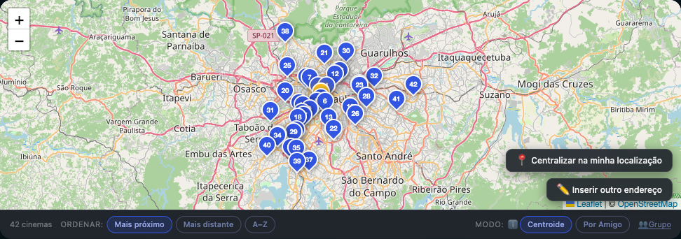
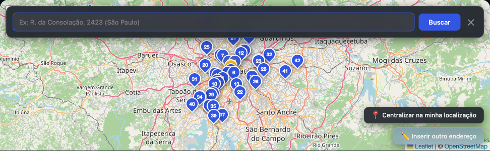
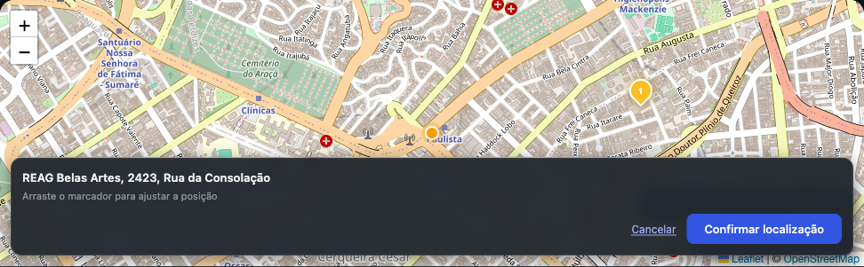
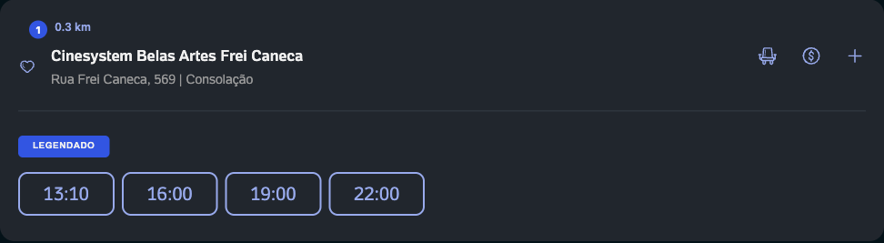
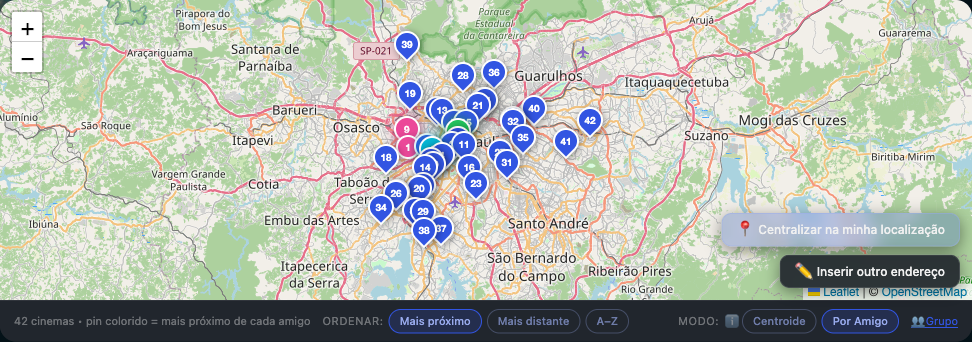
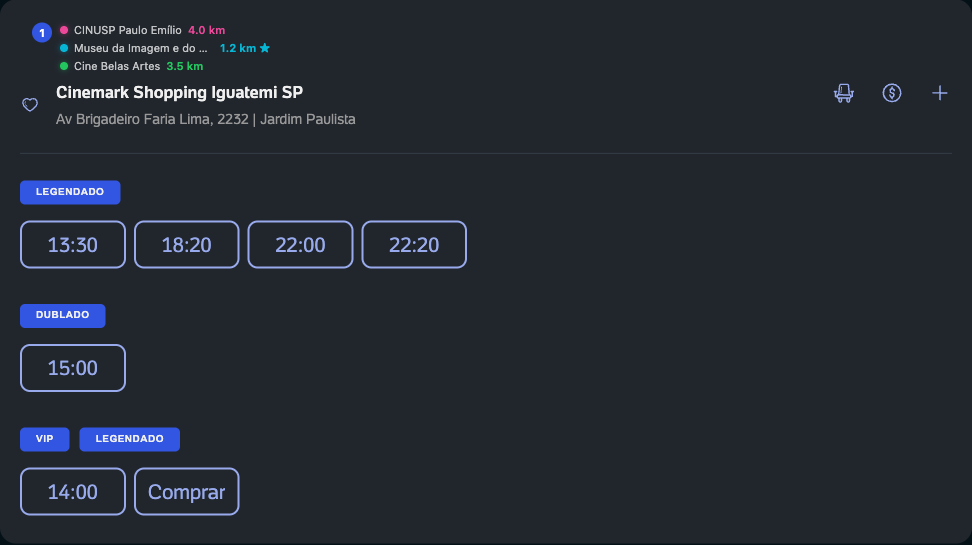

# Ingresso Cinema Map

Extensão para Chrome que embute um mapa interativo de cinemas diretamente nas páginas de filme do [ingresso.com](https://www.ingresso.com).

Veja os horários, compare distâncias e encontre o cinema mais conveniente — sem sair da página.



## Funcionalidades

- **Mapa embutido** — painel integrado ao layout do ingresso.com, com pins numerados por proximidade
- **Ordenação automática** — reordena a lista de cinemas da página e injeta badges de distância
- **Localização flexível** — geolocalização automática, busca por endereço ou arraste do marcador no mapa
- **Pré-visualização** — confirme o endereço no mapa antes de aplicar (marcador laranja → azul ao confirmar)
- **Restrito à cidade** — geocodificação e cinemas respeitam a cidade selecionada no site
- **Modo grupo** — adicione endereços de amigos e compare cinemas (centroide ou por amigo)
- **Atualização automática** — detecta troca de dia e mudança de cidade na página

## Instalação

A extensão será publicada na **Chrome Web Store**. O link de instalação será adicionado aqui assim que estiver disponível.

Site: [ingresso-cinema-map.pages.dev](https://ingresso-cinema-map.pages.dev) (landing page e [política de privacidade](https://ingresso-cinema-map.pages.dev/privacy.html)).

### Para desenvolvedores

Para testar localmente ou contribuir com o projeto:

1. Clone o repositório:

   ```bash
   git clone https://github.com/EdYuTo/ingresso-cinema-map.git
   ```

2. Abra `chrome://extensions` no Chrome
3. Ative **Modo do desenvolvedor**
4. Clique em **Carregar sem compactação** e selecione a pasta do projeto

A extensão aparece em qualquer página `https://www.ingresso.com/filme/*`.

## Como usar

1. Abra um filme em cartaz no ingresso.com (ex.: [Homem-Aranha](https://www.ingresso.com/filme/homem-aranha-um-novo-dia?city=sao-paulo))
2. O mapa carrega no topo da lista de cinemas
3. Permita a localização ou use **Inserir outro endereço** para buscar manualmente
4. Use os chips **Mais próximo / Mais distante / A–Z** para ordenar — o pin amarelo destaca o cinema correspondente ao filtro
5. Clique em **Grupo** para comparar cinemas com amigos

### Buscar endereço



Digite o endereço e clique **Buscar**. A busca é limitada à cidade selecionada no ingresso.com (canto superior esquerdo).

### Confirmar localização



O marcador laranja mostra a pré-visualização. Arraste para ajustar e clique **Confirmar localização**.

### Lista de cinemas ordenada



Cada card na página recebe um badge numerado com a distância em km.

### Modo grupo


Adicione endereços de amigos por busca ou clique no mapa. Escolha o modo de cálculo:

| Modo | Descrição |
|------|-----------|
| **Centroide** | Cinema mais próximo do ponto médio do grupo (pin amarelo) |
| **Por Amigo** | Cor por amigo; pin colorido no cinema mais próximo de cada um |



No modo **Por Amigo**, cada amigo recebe uma cor. O cinema mais próximo de cada um fica com pin na mesma cor; a lista abaixo mostra a distância individual.



Cada card exibe uma linha por amigo (cor, endereço e distância). O ★ marca o cinema ideal daquele amigo.

## Capturas de tela

As imagens acima são geradas automaticamente com Playwright, carregando a extensão real no Chromium:

```bash
npm install
npx playwright install chromium   # necessário na primeira vez
npm run screenshots
```

O script abre uma janela do **Chromium (Playwright)** com a extensão instalada via `--load-extension`, navega até uma página de filme no ingresso.com e salva as capturas em `website/images/`.

> **Nota:** use o Chromium do Playwright (`npx playwright install chromium`), não o Google Chrome — extensões MV3 não carregam corretamente com `channel: 'chrome'`.

## CI / Chrome Web Store

- **Test** — roda em todo PR e push para `main` (testes de fixture)
- **Release** — manual apenas: cria tag git, GitHub Release com notas e, opcionalmente, publica na Chrome Web Store (configure os secrets do Chrome Web Store em **Settings → Secrets and variables → Actions** antes de rodar)

## Tecnologias

- [Manifest V3](https://developer.chrome.com/docs/extensions/mv3/) — Chrome Extension
- [Leaflet](https://leafletjs.com/) — mapa interativo
- [OpenStreetMap](https://www.openstreetmap.org/) / [Nominatim](https://nominatim.org/) — tiles e geocodificação
- [Ingresso Content API](https://api-content.ingresso.com/) — coordenadas dos cinemas

## Licença

[MIT](LICENSE) — Edson Yudi Toma
